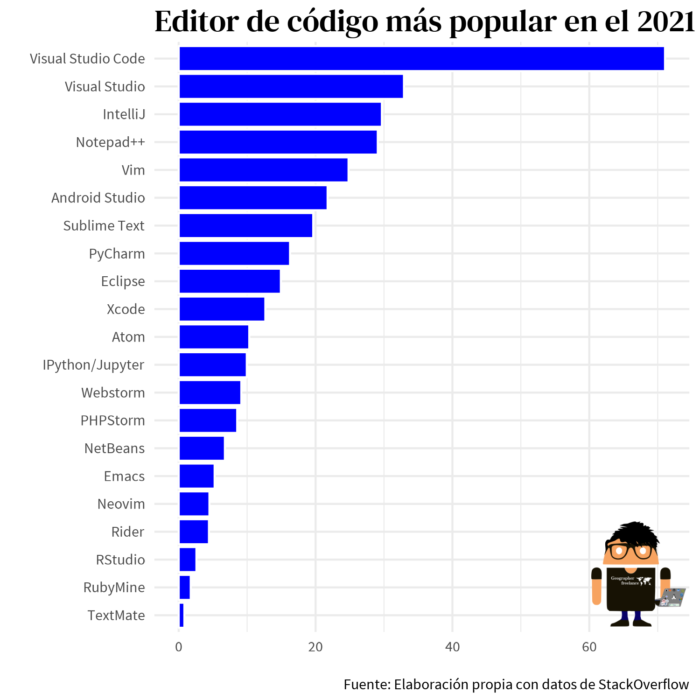

# __A summary of stackoverflow's 2021 statistics on the best code editor for developers__

### __The Integrated development environment__

Visual Studio Code has a significant lead as the IDE of choice across all developers.

### Reference :
 * https://insights.stackoverflow.com/survey/2021#overview
